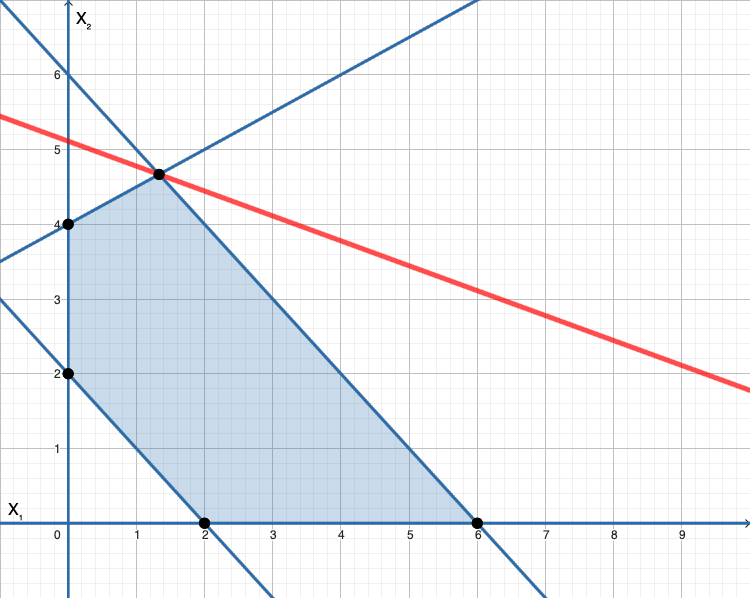
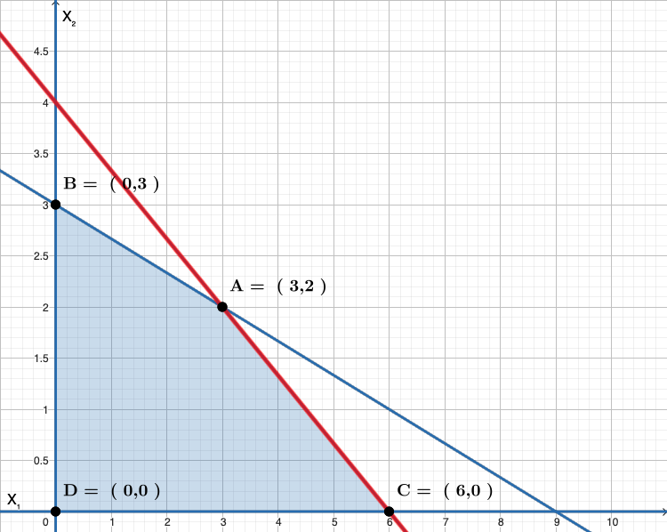
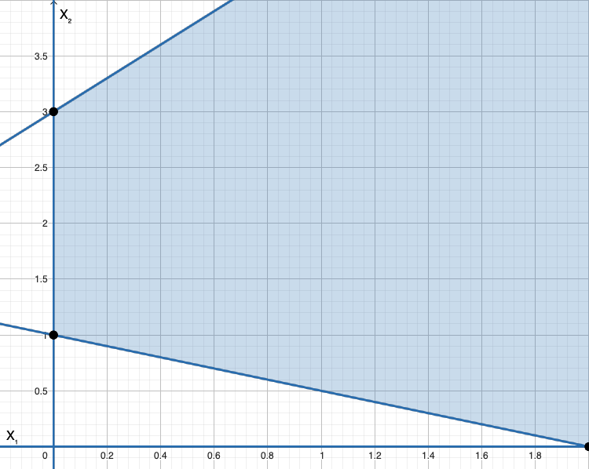
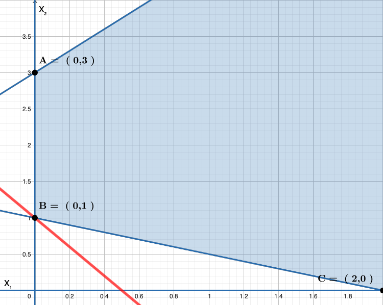
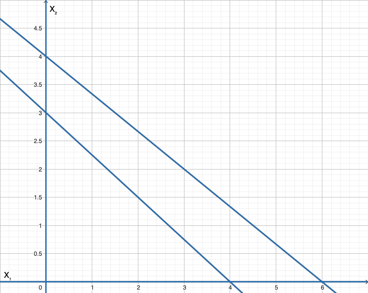

# Introduzione alla Programmazione Lineare
## Algoritmi di Ottimizzazione
### Modelli
Per poter definire un algoritmo di ottimizzazione, è necessario definire il modello matematico, rappresentato come:

$$
\begin{align*}
& z_p = \text{min}\quad f(\textbf{x}) \\
& \qquad s.t. \\
& \qquad\qquad g_i(\textbf{x}) \leq b_i  & i=1..n \\
& \qquad\qquad g_j(\textbf{x}) = d_j    & j=1..m \\
& \qquad\qquad x \geq 0
\end{align*}
$$

dove:
- La funzione $f(\textbf{x})$ è la **funzione obiettivo**.
- La variabile $\textbf{x}$ è la **variaibile decisionale**.
- Le epsressioni $g_i(\textbf{x}) \leq b_i$ e $h_j(\textbf{x}) = d_j$ rappresentano i **vincoli**.
- L'espressione $\textbf{x} \geq 0$ è il **vincolo di non negatività**.

Inoltre:
- Se le funzioni $f(\textbf{x})$, $g_i(\textbf{x})$ e $h_j(\textbf{x})$ sono *lineari*, si parla di programmazione lineare **continua**.
- Se vi sia il vincolo aggiuntivo che la soluzione deve avere *tutte* le componenti interi, si parla di programmazione lineare **intera**.
- Se solo alcune componenti di $\textbf{x}$ devono essere intere, programmazione lineare **mista intera**.

### Lower e Upper Bound
Dato un problema di programmazione lineare di *minimo*, un valido **lower bound** è una stima per difetto del valore della soluzione ottima: $ z_{LB} \leq z_P $. Il suo calcolo è reso posssibile da **procedure di Bounding**.

È possibile invece individuare un **upper bound**, ovvero una soluzione ammissibile calcolata come stima per eccesso del valore della soluzione ottima: $ z_P \leq z_{UB} $. È calcolabile tramite **procedure euristici** (euristiche?).

Nel caso il problema di PL sia di *massimo*, i ruoli si invertono, ovvero le procedure di bounding forniscono l'upper bound, mentre i metodi euristici un lower bound.

---
Un **algoritmo esatto** invece, è un algoritmo che *garantisce* la determinazione della soluzione ottima di P (compatibilmente con le risorse di memoria e tempo di calcolo disponibili).

### Knapsack Problem
Obiettivo: determinare quale degli $n$ oggetti di peso $w_i$ e profitto $p_i$ devono essere inseriti nel knapsack di capacità $W$ per **massimizzare il profitto** complessivo.

Il modello matematico per il problema del knapsack (0-1) è il seguente:
$$
\begin{align*}
    (KP) & \qquad z_{KP} = \text{max} \sum_{i=1}^n{p_ix_i} \\
    & \qquad\qquad s.t. \\
    & \qquad\qquad\qquad \sum_{i-1}^n{w_ix_i} \leq W \\
    & \qquad\qquad\qquad x_i \in \{0,1\}, & i=1..n
\end{align*}
$$

#### KP: Upper Bound
Possiamo calcoalre un buon **Upper Bound** risolvendo il **rilassamento continuo** della formulazione matematica:
$$
\begin{align*}
    (LKP) & \qquad z_{LKP} = \text{max} \sum_{i=1}^n{p_ix_i} \\
    & \qquad\qquad s.t. \\
    & \qquad\qquad\qquad \sum_{i-1}^n{w_ix_i} \leq W \\
    & \qquad\qquad\qquad 0 \leq x_i \leq 1, & i=1..n
\end{align*}
$$
In questo caso all'interno delle condizioni di esistenza *diamo la possibilità di prendere frazioni di elementi* nel caso in cui non si potesse prendere l'elemento interamente.
È possiible così ricavare un valido upper bound mediante il seguente algoritmo:
```python
def upper_bound_KP(W, w, p, x):
    # Ordina tutti gli oggetti per ordine non crescente (decrescente) di r[i] = p[i]/w[i]
    # Inizializza W1 = W e x[i] = 0 for i..n
    for i in range(n):
        if W1 >= r[i].weight:
            x[i] = 1;
            W1 -= r[i].weight
        else:
            x[i] = W1/r[i].weight # Elemento Critico, prendo la 
            \ #parte frazionaria che riesco a mettere dentro
            return
```
È importante notare come in questo approccio se arrivassimo al punto in cui riempiamo completamente il knapsack senza solzuzioni frazionare (*Elemento Critico*), allora si arriverebbe direttamente alla soluzione ottima!

#### KP: Euristico
In caso invece sia stata generata una soluzione con un elemento frazionario, è possibile procedere con l'individuazione di un **lower bound** che possa generare una soluzione valida e ammissibile attraverso un algoritmo *greedy* derivato dall'upper bound:
```python
def greedy_KP(W, w, p, x):
    # Ordina tutti gli oggetti per ordine non crescente di r[i] = p[i]/w[i]
    # Inizializza W1 = W e x[i] = 0 for i..n
    for i in range(n):
        if W1 >= r[i].weight: #ci sta? posso usarlo?
        \ #Poiché vogliamo solo soluzioni intere
            x[i] = 1
            W1 -= r[i].weight
```
In questo codice si va rilevare il *lower bound* migliore, si può notare infatti che i nostri elementi vengono presi interamente oppure non vengono presi affatto. 

Questo algoritmo può essere migliorato se si considerano le diverse permutazioni all'ordinamento originario, dando luogo anche alla permutazione per cui si ottiene la soluzione ottima.

### KP: Algoritmi Esatti
La soluzione ottima può essere ricavata mediante due approcci:
- Metodi **Branch \& Bound**
- **Programmazione Dinamica**

#### KP: Branch \& Bound
È un algoritmo di **enumerazione** che utilizza procedure di bounding per ridurre le dimensioni dell'albero di ricerca. Ad **ogni nodo** dell'albero viene calcolato il bounding e possono verificarsi le seguenti condizioni
1. Il bound indica che **non può essere** ottenuta una soluzione migliore della migliore soluzione ammisibile &rarr; il nodo viene eliminato.
2. Il bound fornisce una **soluzione ammissibile** (intera) &rarr; si aggiorna la migliore soluzione ammissibile disponibile e il nodo viene elminato.
3. Non si verifica ne (1) ne (2) (e.g. viene calcolata una soluzione frazionaria) &rarr; **branching**: il problema viene ulteriormente decomposto in $k$ sottoproblemi.

Possiamo così definire i seguenti insiemi per ogni nodo dell'albero:
- $F_0 \subseteq \{1,...,n\}$: variabili fissate a 0, gli elementi che non vengono presi
- $F_1 \subseteq \{1,...,n\}$: variabili fissate a 1, gli elementi che vengono utilizzati
  - ovviamente vale $F_0 \cap F_1 = \empty$
- $L = \{1,...,n\}\setminus(F_0 \cup F_1)$: insieme delle variabili *libere*.

Ora è possibile calcoalre un upper bound ad ogni nodo mediante il seguente **rilassamento lineare** del knapsack:
$$
\begin{align*}
    & (LKP) \qquad z_{LKP}(L,F_0,F_1) = \text{max} \sum_{i \in L} p_i x_i + \sum_{i \in F_1}p_i \\
    & \qquad\qquad s.t. \\
    & \qquad\qquad\qquad \sum_{i \in L}w_i x_i \leq W - \sum_{i \in F_1} w_i \\
    & \qquad\qquad\qquad 0 \leq x_i \leq 1 \qquad i \in L
\end{align*}
$$

La nostra funzione obbiettivo è quindi la sommatoria di tutti gli elementi gia presi $p_i$ sommata alla sommatoria di tutti gli altri elementi che ancora devono essere aggiunti $p_ix_i$.
Nei vincoli invece troviamo $W-\sum_{i \in F_1} w_i$, che si traduce in: rimuovo dallo spazio disponibile $W$ i volumi degli elementi presi $w_i$.  

Un algoritmo Branch \& Bound per il knapsack (0-1) è il seguente:
```python
def BBKP(f0, f1, W, w, p, x, z):
    # L = {1..n} - (f0 | f1) dove | è l'unione dei set
    # Calcolare Z_LKP (L, f0, f1) e sia x1 la sua soluzione
    if Z_LKP(L, f0, f1) < z or Z_LKP(L, f0, f1) is None:
        # Elimina il nodo
        return;
    elif # la variabile dell'elemento critico j è intera:
        if Z_LKP(L, f0, f1) > z: # se la nuova soluzione è maggiore della migliore soluzione ammissibile
            z = Z_LKP(L, f0, f1)
            x = x1
        return;
    else: # la soluzione trovata (j) è frazionaria
        f0 = f0 | (j); BBKP(f0, f1, W, w, p, x, z); f0 = f0 - (j)
        f1 = f1 | (j); BBKP(f0, f1, W, w, p, x, z); f1 = f1 - (j)
```

Dove nello pseudocodice:
- `Z_LKP(L, f0, f1)` = $z_{LKP}$, ovvero l'[upper bound](#kp-upper-bound) calcolato nel nodo corrente dell'albero.
- L'`elif` sta ad indicare che nella soluzione trovata tramite il calcolo dell'upper bound fino a quel punto, l'ultimo elemento trovato $j$ nella soluzione prende il nome di elemento critico poiché può essere intero o frazionario.
  - In caso sia intero e maggiore della soluzione massima corrente, allora la soluzione trovata sostituisce la soluzione corrente.
  - In caso sia frazionario, allora si esplora il suo sottoalbero come indicato dalle chiamate ricorsive nelle ultime due righe.

Il costo computazione dell'algoritmo è pari a $O(2^n)$.

#### KP: Programmazione Dinamica
La DP risolve il problema componendo la soluzione a **stadi** partendo dalle soluzioni parziali dei sottoproblemi seguendo un approccio *bottom-up*.

Essa si applica a **problemi di ottimizzazione** che hanno le seguenti **caratterstiche**:
- Il problema può essere decomposto in **stadi**: ad ogni stadio è associata una **decisione**.
- Ad ogni stadio $k$ il problema può trovarsi in un **numero finito di stati** possibili: $\{s_1^k,...,s_{q_k}^k\}$.
- Può essere definita una **funzione di costo** $f_k(s_i^k)$ dello stato $s_i^k$ dello stadio $k$ che **dipende solo dagli stadi precedenti**.
- Da ogni stato $s_i^k$ dello stadio $k$ può essere calcolato ogni possiible stato dello stadio $k+1$.

Nel caso del knapsack, per risolvere il problema possiamo individuare:
- $n+1$ stadi (numero degli oggetti + 1).
- $W + 1$ stati, dove per ogni stato $w \in \{0,...,W\}$ si risolve il seguente sottoproblma:

$$
\begin{align*}
    & (KP_j(W)) \qquad z_j(w) = \text{max} \sum_{i=1}^j p_ix_i \\
    & \qquad\qquad s.t. \\
    & \qquad\qquad\qquad \sum_{i=1}^j{w_ix_i} \leq w \\
    & \qquad\qquad\qquad x_i \in \{0,1\}, \qquad i=1,...,j
\end{align*}
$$

In questo caso $w$ è lo spazio totale che possiamo ancora occupare all'interno dello zaino in uno specifico stadio. **Per ogni stadio ho tanti stati**. 

Risolvere per ogni stato $w$ dello stadio $j$ i problemi $KP_j(w)$ equivale ad utilizzare la seguente recurcsione:
1. Inizializza $KP_0(w)= 0$, $\forall w \in \{0,...,W\}$
2. Ad ogni stadio $j \in \{1,...,n\}$ e per ogni $w \in \{0,...,W\}$, calcola la recursione:
$$
z_j(w)=\begin{cases}
    z_{j-1}(w)                                  & \text{if} \quad w<w_j\\
    \text{max}\{z_{j-1}(w), z_{j-1}(w-w_j)\}    & \text{if} \quad w\geq w_j
\end{cases}
$$

Nel caso $w\geq w_j$, la funzione di massimo è da interpretare come segue:
- Se scegliessimo l'elemento dello stadio j-esimo ma la soluzione ottenuta è minore della soluzione al passo precedente, allora manteniamo la soluzione come sta.
- Se scegliamo l'elemento dello stadio j-esimo, aggiungiamo al suo profitto ($p_j$) il profitto ottenuto dal caso dello stadio precedente ($j-1$) dello *stato* relativo alla capacità dello zaino meno il peso dell'oggetto j-esimo ($w-w_j$).
  - In questo modo implicitamente vengono non considerate tutte le soluzioni precedenti che risultano peggiori della nuova scelta, riducendo drasticamente i tempi d'esecuzione.


L'algoritmo così implementato ha complessità $O(nW)$, la quale ci suggerisce come sia possibile preferire questo approccio ad un approccio [Branch \& Bound](#kp-branch--bound):
- La complessità della programmazione dinamica dipende fortemente dall'aumento della capacità dello zaino $W$.
- La complessità di B&B esplode all'aumento di $n$ esponenzialmente.

### Programmazione Lineare
La *programmazione lineare* cosiste nel minimizzare o massimizzare una funzione obbiettivo lineare in presenza di vincoli lineari.

$$
\begin{align*}
    & min \quad z_j(w) = \sum_{j=1}^n c_jx_j \\
    & \qquad\qquad s.t. \\
    & \qquad\qquad\qquad \sum_{j=1}^n{a_{ij}x_{ij}} \geq {b_i} \quad i = 1, .., m \\
    & \qquad\qquad\qquad x_j \geq 0, \qquad j=1,...,n
\end{align*}
$$

Una rappresentazione più compatta può essere rappresentata come:

$$
\begin{align*}
    & min \quad z_j(w) =  cx \\
    &  s.t. \quad Ax \geq b \\
    & \qquad x \geq 0
\end{align*}
$$
Dove :
- *c*: è un vettore colonna con N righe
- *x*: è un vettore colonna con N righe e reppresenta le nostre variabili decisionali
- *b*: è un vettore colonna con N righe in cui abbiamo tutti i termini 
- *A*: è una matrice e contiene tutti i coefficienti dei nostri vincoli
  
Nella formulazione di un problema di programmazione lineare sono implicite alcune assunzioni:
* **Proporzionalità**: Ogni variabile $x_j$ constribuisce con la quantità:
  - $c_jx_j$ al valore della funzione obiettivo;
  - $a_{ij}x_j$ al vincolo i, il fenomeno si ripercuote nei vincoli
*  **Addittività**: 
   - Il valore della funzione obiettivo è dato dalla somma dei contributi $c_jx_j$,
   - Il contributo totale ad ogni vincolo i è dato dalla somma dei contributi $a_{ij}x_j$
* **Dati deterministici**:
  - I coefficienti $c_j$, $a_{ij}$ e $b_i$ devono essere noti, se non lo fossero debo portare il modello stocastico in un modello deterministico andando ad individuare degli scenari
  - Nel caso in cui alcuni dati fosser di natura stocastica essi devono essere approssimati con dati deterministici attraverso l'individuazione di *stadi*
* **Continuità delle variabili**: Le variabili possono assumere tutti i valori reali che soddisfano i vincoli
* **Soluzione Ammissibile**: Una soluzione $x$ che soddisfa i vincoli $Ax \geq b$ e i vincoli di *non negatività* $x \geq 0$ è della *soluzione ammissibile*.
* **Regione ammissibile**: L'insieme di tutte le soluzioni ammissibili di un problema è detta *regione ammissibile*.
* **Soluzione Ottima**: La soluzione ammissibile $x^*$ che minimizza (o massimizza) il valore della funzione obbiettivo è detta *soluzione ottima*.
* **Problema senza soluzione**: Se la regione ammissibile è *vuota* diremo che il problema non ha soluzione.


#### Esempio
$$
\begin{align*}
    & \text{min} z = -x_1 - 3x_2 \\
    & -x_1 - x_2 \geq -6 \quad (a) \\
    & x_1 - 2x_2 \geq -8 \quad (b) \\
    & x_1 + x_2 \geq 2 \quad (c) \\
    & x_1 \text{,} \quad x_2 \geq 0 
\end{align*}
$$

In questo caso si può procedere attraverso il modello grafico. La prima operazione che si deve effettuare è quella di andare ad individuare tutte le zone in cui i nostri valori possono esistere, trasformando la nostra disequazione in una semplice equazione. Una volta trovate tutte le rette delle nostre equazioni si andrà a definire quindi la *regione ammissibile* dei nostri valori. Per minimizzare la funzione obbiettivo basta effettuare la derivata prima, il gradiente avrà valori : $[-1, -3]$, se ci muoviamo nel verso opposto alla direzione del nostro gradiente in quanto noi vogliamo *minimizzare* la funzione obbiettivo otterremo il valore che risolverà il nostro modello.


### Programmazione Lineare Intera (MIP)
Un problema di programmazione lineare intera prevede il vincolo aggiuntivo che le variabili decisionali devono assumere valori interi

$$
\begin{align*}
    & min \quad z_j(w) = \sum_{j=1}^n c_jx_j \\
    & \qquad\qquad s.t. \\
    & \qquad\qquad\qquad \sum_{j=1}^n{a_{ij}x_{ij}} \geq {b_i} \quad i = 1, .., m \\
    & \qquad\qquad\qquad x_j \geq 0, \qquad j=1,...,n \\
    & x_j intera \qquad j = 1, ...., n
\end{align*}
$$

## Programmazione Lineare
La programmazione lineare mira a minimizzare o minimizzare una *funzione obiettivo* lineare in presenza di *vincoli* lineari.

Per esempio:
$$
\begin{align*}
& \text{min} \quad z = \sum_{j-1}^n c_jx_j \\
& \qquad s.t. \\
& \qquad\qquad \sum_{j-1}^n a_{ij}x_j \geq b)i & i=1,...,m \\
& \qquad\qquad x_j \geq 0 & j=1,...,n
\end{align*}
$$

dove:
- $x_j$ variabile decisionale
- $c_j$ coefficiente di costo della variaible $x_j$
- $b_i$ termine noto del vincolo $i$
- $a_{ij}$ coefficiente della variaible $x_j$ nel vincolo $i$
- $z$ valore della funzione obiettivo.

È possibile rappresentare il sistema lineare mediante le matrici, ottenendo così:
$$
\begin{align*}
& \text{min} \quad z = \textbf{cx} \\
& \qquad s.t. \\
& \qquad\qquad \textbf{Ax} \geq \textbf{b} \\
	& \qquad\qquad \textbf{x} \geq 0
\end{align*}
$$
Dove le matrici coinvolte sono:
$$
\textbf{c} = \begin{bmatrix}
c_1\\
c_2\\
\vdots \\
c_n
\end{bmatrix}
\qquad
\textbf{x}= \begin{bmatrix}
x_1 \\
x_2 \\
\vdots \\
x_n
\end{bmatrix}
\qquad
\textbf{b}= \begin{bmatrix}
b_1 \\
b_2 \\
\vdots \\
b_m
\end{bmatrix}
\qquad
\textbf{A}= \begin{bmatrix}
a_{11} & a_{12} & \dots & a_{1n} \\
a_{21} & a_{22} & \dots & a_{2n} \\
\vdots & \vdots & \ddots & \vdots \\
a_{m1} & a_{m2} & \dots & a_{mn} \\
\end{bmatrix}
$$

e in particolare:
- nell'equazione $\textbf{Ax} \geq \textbf{b} \\$ la soluzione del prodotto matrice vettore della disequazione ha la seguente forma lineare:
$$
\begin{cases}
a_{11}x_1 + a_{12}x_2 + \dots + a_{1n}x_n \geq b_1 \\
a_{21}x_1 + a_{22}x_2 + \dots + a_{2n}x_n \geq b_2 \\
\vdots \\
a_{m1}x_1 + a_{m2}x_2 + \dots + a_{mn}x_n \geq b_m \\
\end{cases}
$$
- Nel prodotto $z = \textbf{cx}$, è sottointeso che il vettore colonna $\textbf{c}$ venga trasposto affinche possa avvenire il prodotto scalare, quindi in realtà $z =\textbf{c}^T\textbf{x}$, ma si usa la forma semplificata quando è facilmente deducibile come in questo caso.
- La matrice $\textbf{A}$ è anche detta **matrice dei vincoli**, contenente i coefficienti delle variabili decisionali, escludendo i termini noti.

### Assunzioni implicite per LP
Nella formulazione di un problema di PL, sono implicite le assunzioni di:
- **Proporzionalità**: ogni variabile $x_j$ contribuisce con la quantità:
	- $c_jx_j$ al valore della funzione obiettivo.
	- $a_{ij}x_j$ al vincolo $i$.
- **Addittività**: ogni componente deve dare il suo contributo, in particolare:
	- Il valore della funzione obiettivo è dato dalla **somma** dei contributi $c_jx_j$ forniti da ciascuna variabile $j$.
	- Il contributo totale ad ogni vincolo $i$ è dato dalla somma dei contributi $a_{ij}x_j$ forniti da ciascuna variaible $j$.
- **Dati Deterministici**: tutti i coefficienti e parametri di un problema di PL, $c_j$, $a_{ij}$ e $b_i$ devono essere **noti**.
	- Nel caso che alcuni dati fossero non noti o di natura stocastica, essi devono essere approssimati con dati deterministici, per esempio estrapolati da numeri medi o dalla creazione di diversi scenari per varie configurazioni del problema.
	- Non ci addentreremo nella programmazione stocastica.
- **Continuità delle Variabili**: le variabili possono asumere **tutti i valori** reali che soddisfano i vincoli.
	- La programmazione lineare nel continuo, di norma, risolve problemi facili.

### Soluzione di un problema LP
Per ogni problema di programmazione lineare, la sua soluzione può essere di uno (o più) dei seguenti tipi:
- **Soluzione Ammissibile**: Una istanza particolare del vettore $\textbf{x}$ che soddisfa i vincoli $\textbf{Ax}\geq\textbf{b}$ e i vincoli di *non negatività* $\textbf{x} \geq 0$ è detta *soluzione ammissibile*.
- **Regione Ammissibile**:  è l'insieme di tutte le soluzioni ammissibili. Nella PL, assume la forma di un poliedro convesso delimitato o illimitato nella regione del problema.
- **Soluzione Ottima**: La soluzione ammissibile $\textbf{x}^*$ che minimizza/massimizza il valore della funzione obiettivo è detta *soluzione ottima*. In particolare essa può essere:
	- *Nessuna*: quando la soluzione è illimitata, e quindi nessuna è migliore di tutte le altre (vedi esempio sotto).
	- *Unica*
	- *Molteplice*: (ancora esempio sotto magari fare link) sono soluzioni che hanno caratteristiche particolari.
- **Problema senza soluzione**: Se la regione ammissibile è *vuota*, allora diremo che il problema non ha soluzione o che il problema non è ammissibile.

[Link per fare i grafici e calcolare la soluzione ammissibile](https://www.pmcalculators.com/graphical-method-calculator/)
#### Esempio: Soluzione Ottima Unica
Sia il problema di programmazione lineare:
$$
\begin{align*}
    & \text{min} \quad z = -x_1 -3x_2 \\
    & s.t. \\
    & -x_1 -x_2 \geq-6 \\
    & \quad x_1 -2x_2 \geq -8 \\
    & \quad x_1 +x_2 \geq 2 \\
    & \quad x_1, x_2 \geq 0
\end{align*}
$$
È possibile tracciare in un grafico le aree ammissibili per ogni vincolo, in particolare è consigliato il seguente approccio:
- Trovare il valore di $x_1$ mettendo $x_2 = 0$ e risolvere l'equazione per entrambi i membri, ovvero i punti di intersezione con gli assi.
- Tracciare la retta passante per i due punti trovati.
- Individuare se l'origne è compreso nell'intervallo considerato risolvendo la disquazione del vincolo.
- Ripetere per tutti i vincoli del problema.
- Infine tracciare l'area ammissibile nell'interesezione che risulta tra le diverse aree.

Fatto questo, è possibile determinare la zona ammissibile del problema.
Ora è possibile utilizzare il valore del **gradiente** della funzione obiettivo per individuare l'insieme delle *curve di livello* che, intersecandosi col poliedro della zona ammissibile, ci permetterà di determinare l'insieme delle soluzioni e soprattutto la soluzione ottima.

Quindi:

$$\nabla z = \begin{bmatrix}
        \dfrac{\partial z}{\partial x_1} \\
        \dfrac{\partial z}{\partial x_2}
\end{bmatrix}
=\begin{bmatrix}
    -1 \\
    -3
\end{bmatrix}
$$

Il quale ci indica le coordinate della direzione del vettore gradiente di $z$.
In base alla richiesta del problema, dobbiamo decidere se seguire la direzione del gradiente, oppure procedere in direzione opposta ad esso, poiché il gradiente indica dove la funzione cresce maggiormente. Quindi:
- Se il problema PL è di **Massimo**, allora bisogna seguire la direzione del gradiente.
- Se il problema PL è di **Minimo**, bisogna seguire la direzione **opposta** del gradiente.

Nel nostro caso quindi, seguiamo l'inverso del gradiente, ovvero $\begin{bmatrix} 1 \\ 3\end{bmatrix}$. 
Ora è possibile tracciare le rette tangenti alla direzione del gradiente (ovvero le rette perpendicolari), in modo tale da poter individuare quel punto del poliedro che massimizza/minimizza la funzione obiettivo.

La soluzione ottima del problema, corrisponde ad un **vertice** (o **punto estremo**) della regione ammissibile, come mostrato nella figura sotto.



#### Esempio: Soluzioni Ottime Equivalenti
$$
\begin{align*}
    & \text{max} \quad z = 2x_1 + 3x_2\\
    & s.t. \\
    & \quad x_1 + 3x_2 \leq9 \\
    & \quad 4x_1 +6x_2 \leq 24 \\
    & \quad x_1, x_2 \geq 0
\end{align*}
$$
Se ragioniamo come prima per la definizione delle regioni ammissibili, possiamo ottenere il poliedro che definisce l'insieme delle soluzioni del problema. A questo punto calcoliamo il gradiente della funzione $z$, ma a differenza di prima, seguiamo il suo verso poiché si tratta di un problema di masimo. Tracciando le curve di livello però, si può notare come la l'ultima curva che interseca la regione ammissibile ha la stessa inclinazione della retta passante per i punti B e C in figura più sotto. Questo accade perché uno dei vincoli è proporzionale alla funzione obietivo (il secondo dei vincoli), provocando quindi un'insieme di soluzioni ottime in corrispondenza del segmento tra B e C, ovvero dove la funzione obiettivo assume il valore $z^*=12$.
Appartengono alla soluzione ottima quindi i punti $A=(3,2)$ e $C=(6,0)$.


#### Esempio: Soluzione Illimitata
Consideriamo il seguente problema di minimo:
$$
\begin{align*}
    & \text{min} \quad z = -2x_1 - 5x_2\\
    & s.t. \\
    & \quad -3x_1 + 2x_2 \leq6 \\
    & \quad x_1 +2x_2 \geq 2 \\
    & \quad x_1, x_2 \geq 0
\end{align*}
$$
Operando come di consueto, troviamo una **regione ammissibile illimitata**. In particolare, possiamo notare che nella regione amissibile sono contenuti i punti per cui $x_1 = x_2$ dove $x_1 \geq \frac{2}{3}$, perché risolvendo il sistema lineare:
$$
\begin{cases}
    x_1=x_2 \\
    -3x_1 + 2x_1 \leq 6  & \implies x_1 \leq 6\\
    x_1 + 2x_1 \geq 2    & \implies x_1 \geq \frac{2}{3}
\end{cases}
$$

otteniamo il valore minimo di $x_1$. Da questo, possiamo notare che il valore della funzione obiettivo $z = -2x_1 -5x_2$ considerando la condizione $x_1=x_2$ diviene $z = -7x_1$, da cui $z\rightarrow -\infty$ per $x_1 \rightarrow \infty$.


A parte i dati numerici, era possibile capire che la soluzione era illimitata se, come prima, calcolavamo il gradiente della funzione obiettivo $\nabla z = \begin{bmatrix}-2 \\ -5\end{bmatrix}$, e considerando che il problema PL era il minimo di minimo, seguiamo la direzione opposta del gradiente dove la funzione si minimizza. È evidente a quel punto che le curve di livello non toccheranno mai un punto critico della regione ammissibile che sia maggiore di tutti gli altri, potendo constatare al volo che la soluzione era illimitata.


#### Esempio: Regione Illimitata ma soluzione Illimitata
Consideriamo il seguente problema di minimo:
$$
\begin{align*}
    & \text{min} \quad z = 2x_1 + x_2\\
    & s.t. \\
    & \quad -3x_1 + 2x_2 \leq6 \\
    & \quad x_1 +2x_2 \geq 2 \\
    & \quad x_1, x_2 \geq 0
\end{align*}
$$

Similmente a prima tracciamo le regioni ammissibili, e notiamo che la regione ammissibile è illimitata, esattamente come prima. 
Calcoliamo però il gradiente della funzione obiettivo $\nabla z = \begin{bmatrix}2 \\ 1\end{bmatrix}$, e cercando un minimo, ci muoviamo verso la direzione opposta del gradiente, ovvero verso $\begin{bmatrix}-2 \\ -1\end{bmatrix}$ cioè in direzione del terzo quadrante. Il punto critico della regione ammissibile risulta l'ultimo punto che le curve di livello possono intersecare nel poliedro, ovvero il punto $B=(0,1)$.


#### Esempio: Problema senza soluzione
Consideriamo il seguente problema di minimo:
$$
\begin{align*}
    & \text{min} \quad z = 2x_1 + 5x_2\\
    & s.t. \\
    & \quad 2x_1 + 3x_2 \geq12 \\
    & \quad 3x_1 + 4x_2 \leq 12 \\
    & \quad x_1, x_2 \geq 0
\end{align*}
$$

E procedendo come di consueto, se si tracciano le regioni ammissibili si nota come esse siano divergenti senza mai incontrarsi: non esiste una regione ammissibile, perciò non esiste una soluzione ammissibile!



## Programmazione Lineare Intera (MIP)
Un problema di programmazione lineare intera prevede il vincolo aggiuntivo che le **variabili decisionali** devono assumere **valori interi**.

$$
\begin{align*}
    & \text{min}\quad z = \sum_{j=1}^n c_jx_j \\
    & s.t. \\
    & \qquad \sum_{j=1}^n a_{ij}x_j  \geq b_i   & i=1,\dots,m \\
    & \qquad x_j \geq 0                                & j=1,\dots,n \\
    & \qquad x_j \text{intera}                         & j=1,\dots,m
\end{align*}
$$

Dove l'ottimo della programmazione lineare intera può distare molto dall'ottimo della programmazione lineare nel continuo.

#### Manipolazioni di un problema 
* *Minimizzazione e Massimizzazione*: un problema di massimo può essere convertito in un problema di minimo e viceversa: $$ \text{max}\sum_{j=1}^n c_jx_j = -\text{min} \sum_{j=1}^n -c_jx_j $$
* *Inversione di una disequazione*: Una disequazione del tipo "$\geq$" si converte in una disequazione del tipo "$\leq$" moltiplicando entrambe i membri per -1 (ASSURDO DIO CANE): $$ \sum_{j=1}^n a_{ij}x_j \geq b_i \rightrightarrows  \sum_{j=1}^n -a_{ij}x_j \leq -b_i $$
* *Equazioni in disequazioni*: Ad una equazione corrispondono 2 disequazioni: 
$$ 
   \sum_{j=1}^n a_{ij}x_j = b_i \rightarrow \begin{cases}
    \sum_{j=1}^n a_{ij}x_j \geq b_i \\
    \sum_{j=1}^n a_{ij}x_j \leq b_i \\
\end{cases}
$$
* *Disequazioni in equazioni*: Una disequazione può essere trasformata in una equazione utilizzando ima variabile di scarto non negativa: 
$$
    \sum_{j=1}^n a_{ij}x_j \geq b_i \rightarrow \sum_{j=1}^n a_{ij}x_j - x_{n+i}= b_i \\
    \sum_{j=1}^n a_{ij}x_j \leq b_i \rightarrow \sum_{j=1}^n a_{ij}x_j + x_{n+i}= b_i
$$
* *Non negatività delle variabili*: Se nel modello del problema una variabile $x_j$ può assumere qualsiasi valore, allore può essere sostituita con 2 variabili : $x_j^+$ e $x_j^-$ non negative. Si vede una variabile semplice costituita da una parte positiva e da una negativa.
### Forma Canonica e Forma Standard
* *Forma "canonica"*: I vincoli sono tutte disequazioni
$$ 
\begin{align*}
    &z = \text{min } \sum_{j=1}^n c_jx_j \\
    & \qquad \text{s.t}  \\
    & \qquad\qquad \sum_{j=1}^n a_{ij}x_j \geq b_i, \qquad i = 1,...,m \\
    & \qquad\qquad x_j \geq 0 \qquad j = 1,...,n 
\end{align*}
$$
* *Forma "standard"*: I vincoli sono tutte equazioni
$$ 
\begin{align*}
    & z = \text{min } \sum_{j=1}^n c_jx_j \\
    & \qquad \text{s.t} \\
    & \qquad\qquad \sum_{j=1}^n a_{ij}x_j = b_i, \qquad i = 1,...,m \\
    & \qquad\qquad x_j \geq 0 \qquad j = 1,...,n
\end{align*}
$$

### Definizione di Soluzione Base Ammissibile
Si consideri il seguente problema:
$$ 
\begin{align*}
   \text{min } z = \textbf{ cx } \\
    \text{s.t} \qquad \textbf{Ax} = \textbf{b} \\
    \qquad \textbf{x}\geq 0
\end{align*}
$$
dove $\textbf{A} \in R^{m,n}, \textbf{c}, \textbf{x} \in R^n \text{ e } \textbf{b} \in R^m$.
Il problema deve essere definito **necessariamente in forma standard**. Per cui se eventualemtne alcuni vincoli sono disequazioni devono essere trasformati in equazioni. 
Si suppone per semplicità che: $\text{Rango}(A,b) = \text{Rango}(A) = m$
La matrice **A** può essere riscritta per comodità nella forma **A = [B,N]**. Dove $B \in R^{m,n}$ corrisponde a $m$ colonne linearmente indipendenti ed $N \in R^{m, n-m}$ solo le rimanenti $n-m$ colonne di **A**.
Ponendo $x^T = [x_B, x_N]$ il sistema dei vincoli può essere riscritto come:
$$
    [B, N] \begin{bmatrix}
        x_B \\
        x_N
    \end{bmatrix} = b \rightarrow Bx_B + Nx_N = b
$$
e poichè **B** è invertibile (è quadrata e ha rango massimo) si ha:
$$x_B = B^{-1}b-B^{-1}Nx_N$$
Se fissiamo $x_N = 0$ la soluzione $x = [x_B, x_N] = [B^{-1}, 0]$ rappresentano una **Soluzione Base**.
Nel caso in cui $x_B \geq 0$ , ovvero soddisfa i vincoli di non negatività, diremo che *x* è una **Soluzione Base Ammissibile**.


### Insieme Poliedrico Convesso
Un *Insieme Poliedrico Convesso* è definito dall'intersezione di un numero finito di sottospazi chiusi, in sostanza l'insieme di tutte le rette nei nostri vincoli definito una regione del piano in cui si ha un *poliedro convesso*, che definisce la nostra *regione ammissibile*. Si definisce come:
$$
X = \{x: Ax \geq b, x \geq 0\}
$$
oppure 
$$
X = \{x: Ax = b, x \geq 0\}
$$

Ogni punto **x** di un insieme poliedrico convesso $X$, che non può essere espresso, come comibiazione di due punti $x^1, x^2 \in X$ tali che $x^1 \neq x$ e $x^2 \neq x$ è detto **Punto Estremo** di $X$.


#### Teoremi
**Teorema**: L'insieme dei punti estremi dell'insieme poliedrico convesso $X = \{x: Ax \geq b, x \geq 0\}$ corrisponde all'insieme delle soluzioni base ammissibili. 

**Teorema**: Un insieme poliedrico convesso $X = \{x: Ax = b, x \geq 0\}$ ha un numero finito di punti estremi.
**Dimostrazione**: Se la matrice **A** di ordine $(m, n)$ è di rango pieno, allora il numero massimo di basi è pari al numero di possibili scelte di $m$ delle $n$ colonne di **A**; ossia :
$$
{n \choose m} = \frac{n!}{m!(n-m)!}
$$

**Teorema** Se la soluzione ottima di un problema di programmazione lineare è finita, allora il punto di minimo si ottiene in corrispondenza di alemno uno dei punti estremi. Un vettore non nullo **d** è detto *direzione* dell'insieme convesso $X$, se dato un qualsiasi punto $x_0 \in X$ ogni altro punto $x=x_0 + \lambda d, \lambda \geq 0$ appartiene a $X$ ($\lambda$ mi rappresenta di quanto è il mio spostamento). 

**Teorema**: Dato un insieme poliedrico convesso $X = \{x: Ax = b, x \geq 0\}$, il vettore **d** è direzione di $X$ se e solo se: $Ad=0, d\geq0, d \neq 0$. 
* Due vettori $d_1$ e $d_2$ sono distinti se $d_1 \neq \beta d_2$ per ogni $\beta$.
* Un vettore **d** è detto *direzione estrema* di $X$ se non può essere rappresentato come combinazione lineare di altre due direzioni distinte $d_1$ e $d_2$. 


##### Teorema della Rappresentazione
Sia dato:
- Un insieme poliedrico convesso $X = \{\textbf{x}: \textbf{Ax} = \textbf{b}, \textbf{x} \geq 0\}$
- Un insieme $P$ di tutti i punti estremi di $X$, tale che $P=\{\textbf{x}_i: i=1,\dots,np\}$
- Un insieme $D$ di tutte le direzioni estreme di $X$, tale che $D=\{\textbf{d}_j:j=1,\dots, nd\}$

Allora ogni punto di $X$ può essere rappresentato come:
$$
\begin{align*}
    & \textbf{x} = \sum_{i=1}^{np}\lambda_i \textbf{x}_i + \sum_{j-1}^{nd}\mu_j\textbf{d}_j \\
    & s.t. \\
    & \qquad \sum_{i=1}^{np} \lambda_i = 1 \\
    & \qquad \lambda_i \geq 0 & i=1,\dots,np \\
    & \qquad \mu_j\geq 0 & j=1,\dots,nd \\
\end{align*}
$$

Dove:
- $\sum_{i=1}^{np}\lambda_i \textbf{x}_i$  rappresenta l'insieme delle **combinazioni convesse dei punti estremi**
  - Dove la definizione di combinazione convessa è la somma di un insime di punti del piano per un certo $\lambda_i$ tale che $\sum_{i=1}^{np} \lambda_i = 1$
- $\sum_{j-1}^{nd}\mu_j\textbf{d}_j$ è l'insieme delle combinazioni lineari delle direzioni estreme
- Solo grazie alla combinazione delle direzioni e dei punti estremi posso arrivare a definire ogni singolo punto della regione ammissibile.
- Se il poliedro è **limitato**, allora $D=\empty$.

**Teorema**: la soluzione ottima è **finita**, se e solo se $\textbf{cx} \geq 0, j=1,\dots,nd$. In questo caso il **minimo** si ottiene in corrispondeza di almeno uno dei punti estremi.

**Dimostrazione**: dal teorema della rappresentazione, si può riscivere la funzione obiettivo come:
$$\text{min} z = \textbf{cx} = \sum_{i=1}^{np}(\textbf{cx}_i)\lambda_i + \sum_{j=1}^{nd}(\textbf{cd}_j)\mu_j$$
Dove abbiamo semplicemente moltiplicato i termini del teorema della rappresentazione al vettore di costo $\textbf{c}$.
È evidente ora che per minimizzare la funzione obiettivo, è necessario minimizzare al massimo la seconda sommatoria. Possiamo quindi:
- Se per almeno una direzione estrema $\textbf{d}_j$ si ha $\textbf{cd}_j < 0$, allora possiamo aumentare arbitrariamente $\mu_j$ e la funzione obiettivo risulterà **illimitata**.
- Se $\textbf{cd}_j \geq 0$ per ogni direzione, allora consideriamo il vincolo $\mu_j \geq 0$, quindi il valore più piccolo che possiamo scegliere per minimizzare la funzione obiettivo è proprio $\mu_j = 0$. In questo caso la funzione obiettivo si riduce a:
$$\text{min} z = \textbf{cx} = \sum_{i=1}^{np}(\textbf{cx}_i)\lambda_i$$
Siccome $\sum_{i=1}^{np} \lambda_i = 1$ e $\lambda_i \geq 0$ allora la soluzione è sicuramente **finita**.

Sia $x_p$ un punto estremo tale che $\textbf{cx}_p \leq \textbf{cx}_i$, per ogni $i=1,\dots,np$.
Se ora consideriamo un qualsiasi punto $\textbf{x} \in X$, avremo:
$$\textbf{cx}=\sum_{i=1}^{np}(\textbf{cx}_i)\lambda_i \geq \sum_{i=1}^{np}(\textbf{cx}_p)\lambda_i = (\textbf{cx}_p)\sum_{i=1}^{np}\lambda_i = \textbf{cx}_p$$
quindi:
$$\textbf{cx} \geq \textbf{cx}_p$$
Recap: preso un qualsiasi punto di $X$, esprimibile come combinazione convessa di punti e come combinazione linare di direzioni, allora la soluzione sarà in corrispondenza dei punti estremi.

### Miglioramento di una Soluzione Base
Il valore della funzione obiettivo corrispondente alla soluzione base $\textbf{x} = [\textbf{x}_B, \textbf{x}_N] = [\textbf{B}^{-1}\textbf{b}, 0]$, corrisponde a:
$$z = \textbf{cx} = [\textbf{c}_B, \textbf{c}_N] \begin{bmatrix}\textbf{x}_B \\ \textbf{x}_N\end{bmatrix} = [\textbf{c}_B, \textbf{c}_N] \begin{bmatrix}\textbf{B}^{-1}\textbf{b} \\ 0\end{bmatrix} \textbf{c}_B\textbf{B}^{-1}\textbf{b}$$

Per determinare come varia la funzione obiettivo per **vincoli non nulli** delle variabili non base $\textbf{x}_N$, dato che (mi sono rotto il cazzo di fare le lettere in grassetto con \textbf d'ora in avanti tutte le x miniscole, b miniscole e maiuscole sono matrici e vettori :) ) $x_b = B^{-1}b - B^{-1}Nx_N$ avremo:
$$
\begin{align*}
    z = & c_B x_B + c_Nx_N \\
      = & c_B(B^{-1}b - B^{-1}Nx_N) + c_Nx_N \\
      = & c_BB^{-1}b - (c_BB^{-1}Nx - c_N)x_N \\
\end{align*}
$$

Definiendo $w = c_BB^{-1}$, possiamo scrivere:
$$z = wb-(wN - c_N)x_N = wb - \sum_{k \in N}(wa_k - c_k)x_k$$
Dove:
- $N$ è l'insieme degli indici delle variabili/colonne della matrice non base.
  - Quindi $a_k$ indica le colonne non in base

Possiamo interpretare l'equazione come divisa in due:
- La prima parte $wb$, rappresenta la soluzione corrente trovata (ovvero le $m$ colonne scelte all'inizio da mettere in base senza nessun criterio apparente).
- La seconda parte invece $(wN-c_N)x_N$, rappresenta l'**aggiornamento** che sarebbe possibile effettuare se si scegliessero alcune colonne nella matrice non base ($N$).

Da qui possono verificarsi due configuarazioni.
- Se $(wN-c_N) \leq 0$, allora nessuna scelta di $x_k$ può aumentare la soluzione corrente. La soluzione base amissibile corrente $\textbf{x}$ è **ottima**.
- Nel caso invece esistesse una colonna $k$ non base tale che:
$$wa_k - c_k > 0$$
Allora il valore della funzione obiettivo può decrescere dal valore attuale $z_0 = wb = c_BB^{-1}b$ al valore $z = z_0 - (wa_k-c_k)x_k$. Un'euristica è quella di scegliere la colonna $k$ per cui il valore $(wa_k - c_k)$ sia maggiore.

L'entità del miglioramento della nuova funzione obiettivo, dipende dal valore massimo che può assumere la variaible $x_k$, **garantendo** che la nuova soluzione sia *sempre* soluzione base ammissibile.
Per determinare quanto posso aumentare la variabile $x_k$ per avere una nuova soluzione base ammissibile, consideriamo ancora l'equazione che determina la soluzione $x_B$ in funzione di $x_N$, ovvero la solita:
$$x_B = B^{-1}b - B^{-1}Nx_N$$
Dove possiamo riscrivere i fattori come:
- $\bar{b} = B^{-1}b$
- $y^k = B^{-1}a_k$ ipotizzando che $x_j = 0, \forall j \in N \setminus \{k\}$, ovvero che scelgo solo una colonna $k$ tra le $n$ nella matrice non base $N$ (ha più senso leggere sta riga dopo aver visto l'equazione sotto)

Ottenendo:
$$\textbf{x}_B = \bar{\textbf{b}} - \textbf{y}^kx_k$$

Fare alla notazione di matrici/vettori (si qui ho avuto voglia di mettere le matrici in grassetto così si capisce cosa è matrice/vettore e cosa no)
Per ogni componente i-esima di $\textbf{x}_B = 1,\dots, m$ si ha che:
$$x_i = \bar{b}_i - y_i^kx_k$$
E se vogliamo che la soluzione base rimanga ammissibile, abbiamo bisogno di aumentare $x_k$ in modo tale che
$$x_i = \bar{b}_i - y_i^kx_k \geq 0$$
Ovvero per ogni variabile attualemente in base, vogliamo che il suo valore aggiornato sia sempre $\geq 0$. Quindi per opgni i, la variabgile $x_k$ deve rispettare la condizione:
$$x_k \leq \frac{\bar{b}_i}{y_i^k}$$

Il valore massimo che la variabile $x_k$ può assumere per trovare il maggior aumento, è dato dal **Rapporto Minimo**:
$$x_k = \frac{\bar{b}_r}{y_r^k} = \min_{i=1,\dots, m} \left[ \frac{\bar{b}_i}{y_i^k} : y_k > 0\right]$$

Da qui è possibile capire che:
- Nel caso in cui $\textbf{y}^k \leq 0$ (ovvero quando tutti gli $y_i^k \leq 0$), la funzione obiettivo è **illimitata**, in quanto $(\textbf{wa}_k - c_k) > 0$ e $x_k$ può arbitrariamente crescere **garantendo l'ammissibilità** della soluzione.

Una volta aggiornato il valore della variabile $x_k$, tutte le variabili $x_i$ in base sono aggiornate come segue:
$$x_i = \bar{b}_i-y_i^k \frac{\bar{b}_r}{y^k_r}$$
Mentre (come già detto sopra), tutte le altre variabili non base diverse da $k$, rimangono nulle.

- È importante notare che la variabile $x_r$ ($x_r = \frac{\bar{b}_r}{y^k_r}$) dopo essere stata aggiornata, sarà nulla e la sua colonna $\textbf{a}_k$ sostituisce la colonna $\textbf{a}_r$ nella base $\textbf{B}$.
  - Diremo che $x_k$ **entra** in base, mentre $x_r$ esce dalla base.

## Alogritmo del Simplesso Primale

##### Step 1: Inizializzazione
È possibile definire una soluzione base ammissibile
$\textbf{x} = [\textbf{x}_B, \textbf{x}_N] = [\textbf{B}^{-1}\textbf{b}, 0] = [\bar{\textbf{b}}, 0]$  di costo $z = \textbf{c}_B \textbf{x}_B = \textbf{c}_B\textbf{B}^{-1}\textbf{b}$
Con $\textbf{c}_B$ che è il costo associato alle variabili in base $\textbf{x}_B$

##### Step 2: Pricing
1. Si può calcolare ora $\textbf{w} = \textbf{c}_B\textbf{B}^{-1}$, che equivale a risolvere il sistema lineare $\textbf{w}\textbf{B} = \textbf{c}_B$.
2. Si calcolano i **costi ridotti** $\textbf{w}\textbf{a}_j - c_j$ per le variabili non base $j \in N$
3. Si determina $\textbf{w}\textbf{a}_k - c_k = \max_{j \in N} \{\textbf{w}\textbf{a}_k - c_j\}$

Quest'ultimo punto ci dice che, se trovo qualche valore positivo tale per cui $\textbf{w}\textbf{a}_j - c_j \geq 0$, allora prendo il massimo tra questi (l'euristica di cui si è parlato sopra), cioè prendo il massimo di quei fattori che potrebbero migliorare la funzione obiettivo $z$.

##### Step 3: Condizioni di Ottimalità
Se $\textbf{w}\textbf{a}_j - c_j  < 0$, allora mi fermo poiché siamo di fronte alla **soluzione ottima**!

##### Step 4: La variabile $k$ è candidata a entrare in base
1. Si può calcolare $\textbf{y}^k = \textbf{B}^{-1}\textbf{a}_k$, che quivale a risolvere il sistema lineare $\textbf{B}\textbf{y}^k = \textbf{a}_k$
2. Se $\textbf{y}^k \leq 0$, allora la soluzione è **illimitata**

##### Step 5: Rapporto Minimo
1. Si calcola il valore da assegnare a $x_k$ tramite
$$x_k = \frac{\bar{b}_r}{y_r^k} = \min \left\{ \frac{\bar{b}_i}{y_i^k} : y_i^k > 0 \quad i=1,\dots, m\right\}$$
Che significa che prendo la colonna $\textbf{a}_r$ in $\textbf{x}_B$ e la sostituisco con la minima colonna $\textbf{a}_k$ in $\textbf{x}_N$.

Si dice quindi che la variabile $x_r$ esce dalla base e $x_k$ entra al posto suo.

1. Aggiorna $\textbf{B}$, $\textbf{N}$ e la soluzione base $\textbf{x} = [\textbf{x}_B, \textbf{x}_N] = [\textbf{B}^{-1}\textbf{b}, 0] = [\bar{\textbf{b}}, 0]$.
2. Ritorna allo [Step 2](#step-2-pricing).

## Problema Duale
Si consideri il problma LP in forma canonica, chiamato problema **primale**:
$$
\begin{align*}
    z_P = & \min \textbf{cx} \\
    & s.t.  \\
    & \qquad \textbf{Ax} \geq \textbf{b} \\
    & \qquad \textbf{x}\geq 0
\end{align*}
$$

dove l'insieme dei suoi punti ammissibili è $X = \{\textbf{x}: \textbf{Ax}\geq \textbf{b}, \textbf{x} \geq 0 \}$.

Si definisce il suo **problema duale** nel seguente modo:
$$
\begin{align*}
    z_D = & \max \textbf{wb} \\
    & s.t.  \\
    & \qquad \textbf{wA} \leq \textbf{c} \\
    & \qquad \textbf{w}\geq 0
\end{align*}
$$

dove l'insieme dei suoi punti ammissibili è $W = \{ \textbf{w}: \textbf{wA} \leq \textbf{c}, \textbf{w} \geq 0 \}$.

Chiameremo quindi:
- $\textbf{x}$ variabili primali.
- $\textbf{w}$ variabili duali.

Osservazioni:
- Ciò che era un costo nel primale, diventa un vincolo nel duale.
- Ciò che è un vincolo nel duale, è un costo nel primale.
- Per ogni $\textbf{w}$ corrisponde un termine noto nel primale
  - $\textbf{w}$ mi dice il **costo** di ogni vincolo $\textbf{b}$ nel primale.

### Come ottenere il duale
Partendo dal problema in forma canonica:
$$
\begin{align*}
    z_p = & \min \textbf{cx} \\
    & s.t.  \\
    & \qquad \textbf{Ax} \geq \textbf{b} \\
    & \qquad \textbf{x}\geq 0
\end{align*}
$$

È possibile aggiungere $m$ variabili di **slack** alle $n$ variabili originarie: il primale equivale al problema in forma standard:
$$
\begin{align*}
    z_p = & \min \textbf{cx} \\
    & s.t.  \\
    & \qquad \textbf{Ax} - \textbf{Ix}_s = \textbf{b} \\
    & \qquad \textbf{x}, \textbf{x}_s\geq 0
\end{align*}
$$

Dove $\textbf{I} = [\textbf{a}_{n+1}, \dots, \textbf{a}_{n+m}] = [\textbf{e}_1, \dots, \textbf{e}_m]$ è la matrice identià di ordine $m$.

In corrispondenza di una soluzione ottima del primale, deve esistere una base $\textbf{B}$ per cui:
$$\textbf{w}\textbf{a}_j - c_j \leq 0, \qquad j=1,\dots, n+m$$

Dove si ricorda che $\textbf{w} = \textbf{c}_B\textbf{B}_{-1}$ (vedi [Pricing](#step-2-pricing)).

Si può ora riscrivere la disequazione $\textbf{w}\textbf{a}_j \leq 0$ per le variabili originarie e quelle di slack, ottenendo:
$$
\begin{align*}
   \textbf{w}\textbf{a}_j \leq c_j,  \qquad & j=1,\dots,n  \\
   -\textbf{w}\textbf{e}_i \leq c_j, \qquad & i=1,\dots,m  \\
\end{align*}$$

Queste sono quindi le $\textbf{w}$ che mi soddisfano le condizioni di ottimalità. È importante notare come le variabili di slack non abbiano un costo associato a cui mantenersi come soglia, poiché esse non sono presenti nella funzione obiettivo, ma solo nei vincoli.

Le stesse equazioni di prima possono essere espresse molto più semplicemente in forma matriciale:
$$
\begin{align*}
    \textbf{wA} & \leq c \\
    \textbf{w} & \geq 0
\end{align*}
$$

Quindi abbiamo dimostrato come l'insieme delle soluzioni ammissibili del duale siano definite come: $W  \{\textbf{w}: \textbf{wA} \leq \textbf{c}, \textbf{w} \geq 0 \}$.

Il prossimo passo è quello di mostrare il perché la funzione obiettivo da massimizzare è rappresentata da $\textbf{wb}$.

### Dualità Debole
**Lemma 1. (Dualità Debole)**: Se 
- $\tilde{\textbf{x}} \in X = \{ \textbf{x}: \textbf{Ax} \geq \textbf{b}, \textbf{x} \geq 0 \}$ 
- $\tilde{\textbf{w}} \in W = \{ \textbf{w}: \textbf{wA} \leq \textbf{c}, \textbf{w} \geq 0 \}$

Allora $\tilde{\textbf{w}}\textbf{b} \leq \textbf{c}\tilde{\textbf{x}}$
**Dimostrazione**: Siccome $\tilde{\textbf{x}} \in X$, allora $\textbf{A}\tilde{\textbf{x}}\geq b$. Poiché $\tilde{\textbf{w}} \geq 0$ (quindi posso premoltiplicare senza modificare il segno della disequazione), si ha:

$$
\begin{equation}
    \tilde{\textbf{w}}A\tilde{\textbf{x}} \geq \tilde{\textbf{w}}\textbf{b}
\end{equation}$$

E siccome $\tilde{\textbf{w}} \in W$ allora $\tilde{\textbf{w}}\textbf{A} \leq \textbf{c}$. Poiché $\tilde{\textbf{x}} \geq 0$, si ha:
$$
\begin{equation}
    \tilde{\textbf{w}}A\tilde{\textbf{x}} \leq \textbf{c}\tilde{\textbf{x}}
\end{equation}$$

Dalla (1) e (2) si ricava:
$$\tilde{\textbf{w}}\textbf{b} \leq \textbf{c}\tilde{\textbf{x}}$$ 

Dalla Dualità debole, si deduce che il valore di $\textbf{w}\textbf{b}$ di qualsiasi soluzione $\textbf{w} \in W$ è una stima per difetto (un **lower bound**) alla soluzione ottima del primale.
Il miglior Lower Bound $\textbf{w}^*\textbf{b}$ alla soluzione ottima del primale lo si può ottenere risolvendo il seguente problema duale:
$$
\begin{align*}
    & z = \max \textbf{w}\textbf{b} \\
    & s.t. \\
    & \qquad \textbf{wA} \leq \textbf{c} \\
    & \qquad \textbf{w} \geq 0
\end{align*}$$

**Corollario 1**: Se $\textbf{x}^* \in X$ e $\textbf{w}^* \in W$ soddisfano $\textbf{w}^*\textbf{b} = \textbf{cx}^*$ allora $\textbf{x}^*$ è **soluzione ottima** del primale e $\textbf{w}^*$ è soluzione ottima del duale.

**Dimostrazione**: Per il lemma della *dualità debole* si ha $\textbf{wb} \leq \textbf{cx},$ $\forall \textbf{w} \in W$ e $\forall \textbf{x} \in X$.
Quindi, $\textbf{cx} \geq \textbf{w}^*\textbf{b}$, $\forall \textbf{x} \in X$, ma poiché per ipotesi $\textbf{w}^*\textbf{b} = \textbf{cx}^*$ si ha:
$$\textbf{cx} \geq \textbf{w}^*\textbf{b} = \textbf{cx}^*, \quad \forall\textbf{x} \in X$$
Per cui si deduce che $\textbf{x}^*$ è la soluzione ottima del problema **primale**.

Analogamente, $\textbf{cx}^* \geq \textbf{wb}$, $\forall \textbf{w} \in W$, ma poiché per ipotesi $\textbf{w}^*\textbf{b} = \textbf{cx}^*$ si ha: 
$$\textbf{w}^*\textbf{b} = \textbf{cx}^* \geq \textbf{wb}, \quad \forall \textbf{w} \in W$$
Per cui $\textbf{w}^* \in W$ è soluzione ottima del **duale**.

### Dualità Forte
Il teorema della dualità forte stabilisce che se esistno **soluzioni ammissibili**, sia per il primale sia per il duale, allora esistono due soluzioni ottime i cui valori coincidono.

**Teorema 1. (Dualità Forte)**: Se $X \neq \empty$ e $W \neq \empty$, allora esiste una soluzione $\textbf{x}^*$ ottima per il primale e una soluzione $\textbf{w}^*$ ottima per il duale. Inoltre $\textbf{w}^*\textbf{b} = \textbf{cx}^*$.

**Dimostrazione**: Per il corollario 1 è sufficiente dimostrare l'esistenza di $\textbf{x}^* \in X$ e $\textbf{w}^* \in W$.

- Siccome $W \neq \empty$, per il lemma della dualità debole, il valore $\textbf{cx}$ è limitato inferiormente (Poiché ogni valore di $\textbf{wb}$ di qualsiasi soluzione $\textbf{w} \in W$ è un Lower Bound), per cui non è possibile che la soluzione sia illimitata.
- Siccome $X \neq \empty$ e $\textbf{cx}$ è limitata, implica che il primale ha soluzione ottima limitata.

Scriviamo il primale in forma standard:
$$
\begin{align*}
    z_P = & \min \textbf{cx} \\
    & s.t.  \\
    & \qquad \textbf{Ax} - \textbf{Ix}_s = \textbf{b} \\
    & \qquad \textbf{x}, \textbf{x}_s\geq 0
\end{align*}
$$

Indichiamo con $(\textbf{x}^*, \textbf{x}^*_s)$ la soluzione ottima del primale e con $\textbf{B}$  la corrispondente base ottima.
- Per le condizioni di ottimalità (cioè arriviamo a un punto dove ho solo soluzioni base $\leq 0$) si ha:
$$\textbf{c}_B\textbf{B}^{-1}\textbf{a}_j-c_j \leq 0, \quad j=1,\dots,n+m$$

Dove ponendo $\textbf{w}^*=\textbf{c}_B\textbf{B}^{-1}$, equivale a:
$$
\begin{align*}
    \qquad \textbf{w}^*\textbf{A}   & \leq \textbf{c} \\
    \qquad \textbf{w}^*             & \geq 0
\end{align*}
$$
Che rappresenta la *soluzione duale ammissibile*.
Per cui la soluzione $\textbf{w}^* = \textbf{c}_B \textbf{B}^{-1}$ è duale ammissibile (cioè è nel rispetto dei vincoli del duale).
Infine, siccome $\textbf{w}^* = \textbf{c}_B \textbf{B}^{-1}$ e $\textbf{x}^* = (\textbf{B}^{-1}\textbf{b}, 0)$, si ha:
$$\textbf{w}^*\textbf{b} = \textbf{c}_B\textbf{B}^{-1}\textbf{b} = \textbf{cx}^*$$
Per cui il teorema è dimostrato.

Viene definita dualità forte perché ci basta sapere che $X, W\neq \empty$ per implicare che esiste ed è possibile calcolare una soluzione ottima.

### Relazione tra Primale e Duale
Dal teorema della dualità debole abbiamo che $\textbf{cx} \geq \textbf{wAx} \geq \textbf{wb}$.
Se supponiamo che il primale ha **soluzione ottima non limitata** (illimitata), allora:
$$\textbf{cx} \rightarrow -\infty \implies -\infty \geq \textbf{wb}, \forall \textbf{w}\in W$$
Ovvero che anche il duale non ha soluzioni ammissibili, per esempio l'insieme dei punti ammissibili del duale è vuoto $W = \empty$.
È vero anche il viceversa, ovvero che se il duale ha soluzione ottima non limitata, allora $\textbf{w} \rightarrow  + \infty \implies \textbf{cx}\geq + \infty, \forall\textbf{x} \in X$.

Se il primale **non** ha soluzioni ammissibili, allora il duale:
- O non ha soluzioni ammissibili
- O ha una soluzione ottima non lmimitata

Di seguito una tabella utile in culo
|  |  Duale Ottimo | Duale Non amm. | Duale Illim. |
|-------------|----------------|----------------|--------------|
| **Primale Ottimo** | $$X$$ | | |
| **Primale Non Amm.** | | $$X$$ | $$X$$ |
| **Primale Illim.** | | $$X$$ | |

Questa tabella vale sempre per ogni problema di cui riesco a definire primale e duale.

#### Forme miste del Primale
Dato il seguente problema PL:
$$
\begin{align*}
    \min &z_P = \textbf{cx}& \\
         & s.t. &\textbf{A}_1\textbf{x} &\geq \textbf{b}_1 \\
               &&\textbf{A}_2\textbf{x} &=    \textbf{b}_2 \\
               &&\textbf{A}_3\textbf{x} &\leq    \textbf{b}_2 \\
               &&\textbf{x}& \geq0
\end{align*}
$$

Per poter esprimere il suo duale (e anche per poter applicare il metodo del simplesso), lo riscriviamo in forma standard
$$
\begin{align*}
    \min &z_P = \textbf{cx}& \\
         & s.t. &\textbf{A}_1\textbf{x} & -\textbf{Ix}_S                &&= \textbf{b}_1 &:\textbf{w}_1\\ 
               &&\textbf{A}_2\textbf{x}                                &&&= \textbf{b}_2 &:\textbf{w}_2\\
               &&\textbf{A}_3\textbf{x}       &&+\textbf{Ix}_T           &= \textbf{b}_2 &:\textbf{w}_3\\
               &&\textbf{x}& \geq0
\end{align*}
$$

Dove nominiamo a piacere con $\textbf{w}_n$ rispettivamente:
- $\textbf{w}_1$: l'insieme dei vincoli $\geq 0$ 
- $\textbf{w}_2$: l'insieme dei vincoli  $=0$ 
- $\textbf{w}_3$: l'insieme dei vincoli $\leq 0$ 

I quali rappresenteranno il **vettore di variabili duali**. Quindi, dato il primale in questa forma standard, è possibile scrivere il duale in questo modo:

$$
\begin{align*}
    \max &z_D = &\textbf{w}_1\textbf{b}_1 + &\textbf{w}_2\textbf{b}_2 + \textbf{w}_3\textbf{b}_3 \\
         &s.t. &\textbf{w}_1\textbf{A}_1 + &\textbf{w}_2\textbf{A}_2 + \textbf{w}_3\textbf{A}_3  \leq \textbf{c}              \\
         && \textbf{w}_1 &\geq 0 \\
         && \textbf{w}_2 &\quad\text{qualsiasi} \\
         && \textbf{w}_3 &\leq 0 \\
\end{align*}
$$

È possibile riassumere tutti i possibili casi nella seguente tabella
| Primale | Duale |
|--------|--------|
| min    |  max   |
| Vincolo $i$ | Variabile $w_i$ |
| $$\geq$$ | $$w_i\geq 0$$ |
| $$=$$ | qualsiasi |
| $$\leq$$ | $$w_i\leq 0$$ |
| Variabile $x_j$ | Vincolo $j$ |
| $$x_j \geq 0$$ | $$\leq$$ |
| qualsiasi | $$=$$ |
| $$x_j \leq 0$$ | $$\geq$$ |


### Guida pratica alla costruzione del duale
Prendiamo come esempio il problema PL:
$$
\begin{align*}
    \min &z_P = & x_1 - 2x_2 + 3x_3 &\\
         &s.t.  &x_1 + x_2 \geq 2           &&:\textbf{w}_1\\ 
                &&-x_1 + x_2 - x_3 = 1      &&:\textbf{w}_2\\
                &&+x_2 - 2x_3 \leq 3     &&:\textbf{w}_3\\
                &&x_1 \quad \text{qualsiasi} \\
                &&x_2 \geq0 \\
                &&x_3 \leq0 \\
\end{align*}
$$

1. Definiamo i **nomi** dei vincoli primali in modo tale da avere:
   - $\textbf{w}_1$: insieme dei vincoli primali $\geq 0$
   - $\textbf{w}_2$: insieme dei vincoli primali $= 0$
   - $\textbf{w}_3$: insieme dei vincoli primali $\leq 0$
2. Costruiamo il vettore $\textbf{c}$ prendendo i coefficienti che moltiplicano le $n$ variabili $\textbf{x}$ nel primale, ottentendo:
$$
\textbf{c} = 
\begin{bmatrix}
    1 & -2 & 3
\end{bmatrix}
$$
3. Effettuiamo la stessa cosa con i termini noti degli $m$ vincoli del problema primale, calcolando:
$$
\textbf{b} = 
\begin{bmatrix}
    2 & 1 & 3
\end{bmatrix}
$$

4. Costruiamo la matrice $\textbf{A} \in \mathbb{R}^{m\times n}$ composta da:
   - $n$ colonne tante quante le variabili decisionali del problema
   - $m$ righe tanti quanti i vincoli del problema
$$
\textbf{A} =
\begin{bmatrix}
    1   &1  &0 \\
    -1  &1  &-1 \\
    0   &1  &-2
\end{bmatrix}
$$

È possibile ora costruire il problema duale in questo modo:
1. Se il primale era di minimo, la f. obiettivo del duale sarà di massimo e viceversa
2. Moltiplicare per ogni variabile $\textbf{w}$ individuata nel priamle, i termini noti di quest'ultimo, per cui: 
$$
\textbf{c}^T\textbf{b} = 
\begin{bmatrix}
    w_1 \\ w_2 \\ w_3
\end{bmatrix}
\times
\begin{bmatrix}
    2 & 1 & 3
\end{bmatrix}
= 2w_1 + w_2 + 3w_3
$$
Formando la funzione obiettivo: $\max z_D = 2w_1 + w_2 + 3w_3$.

3. Tutti i coefficienti della funzione obiettivo del primale, diventano termini noti dei vincoli del duale.
4. Per determinare i segni dei vincoli, riferirsi alla tabella sopra.
5. Per ogni riga della matrice $\textbf{A}$ calcolata prima, corrisponde un vincolo duale, e per ogni colonna corrisponde il coefficiente da moltiplicare alla variabile $w_i$. Quindi si ottengono i seguenti vincoli:
$$
\begin{align*}
    w_1 - w_2 = 1               \qquad&:x_1\\
    w_1 + w_2 + w_3 \leq -2     \qquad&:x_2\\
    -w_2 - 2w_3 \geq 3          \qquad&:x_3\\
\end{align*}
$$
1. Infine, i vincoli da applicare alle variabili $w_i$, sono pari al segno $\leq, \geq o =$ che compaiono nel primale (segno del vincolo i-esimo è il segno della variabile i-esima che figura dopo i due punti). Quindi si arriva al problema PL duale pari a:
$$
\begin{align*}
    \max &z_D = & 2w_1 + w_2 + 3w_3 &\\
         &s.t.  &w_1 - w_2 = 1                  &&:\textbf{x}_1\\ 
                &&w_1 + w_2 + w_3 \leq -2       &&:\textbf{x}_2\\
                &&-w_2 - 2w_3 \geq 3            &&:\textbf{x}_3\\
                &&w_1 \geq0 \\
                &&w_2 \quad \text{qualsiasi} \\
                &&w_3 \leq0 \\
\end{align*}
$$

### Condizioni di Complementarietà
Dai teoremi relativi alla dualità, è possibile derivare delle condizioni di ottimalità:
#### Corollario 2 (Complementarietà)
Le soluzioni $\tilde{\textbf{x}} \in X$ del primale e $\tilde{\textbf{w}} \in W$ del duale sono **ottime** se e solo se:
$$
\begin{cases}
    \tilde{\textbf{w}}(\textbf{A}\tilde{\textbf{x}} - \textbf{b}) &= 0 &(a)\\
    (\textbf{c} - \tilde{\textbf{w}}\textbf{A})\tilde{\textbf{x}} &= 0 &(b)\\
\end{cases}
$$
**Dimostrazione**:
Si vuole dimostrare che:
1. Se $(a)$ e $(b)$ sono soddisfatte, allora le soluzioni $\tilde{\textbf{x}}$ e $\tilde{\textbf{w}}$ sono ottime.
2. Se le soluzioni $(a)$ e $(b)$ sono ottime, allora le condizioni $(a)$ e $(b)$ devono essere soddisfatte. 


- **1)** Dal lemma della **dualità debole** si ha che per ogni  $\tilde{\textbf{x}}$ e $\tilde{\textbf{w}}$:
$$\tilde{\textbf{w}}\textbf{b} \leq \tilde{\textbf{w}} \textbf{A} \tilde{\textbf{x}} \leq \textbf{c} \tilde{\textbf{x}}$$
Ma se le condizioni $(a)$ e $(b)$ sono soddisfatte, sostituendo otteniamo:
$$
\begin{cases}
    \tilde{\textbf{w}}\textbf{A}\tilde{\textbf{x}} = \tilde{\textbf{w}}\textbf{b} \\
    \textbf{c}\tilde{\textbf{x}} = \tilde{\textbf{w}}\textbf{A}\tilde{\textbf{x}} \\
\end{cases}
$$
Per cui $\tilde{\textbf{w}}\textbf{b} = \textbf{c}\tilde{\textbf{x}}$ e per il corollario 1 si ha che $\tilde{\textbf{x}}$ e $\tilde{\textbf{w}}$ sono ottime.

- **2)** Se una delle due condizioni di complementarietà non è soddisfatta, allora almeno una delle due soluzioni non è ottima: infatti se fosse per esempio $\tilde{\textbf{w}}(\textbf{A}\tilde{\textbf{x}} - \textbf{b}) > 0$, allora ne consegue che $\tilde{\textbf{w}}\textbf{b} < \textbf{c}\tilde{\textbf{x}}$.


Questo corollario serve a capire che data una solzuzione qualsiasi $\tilde{\textbf{x}} \in X$, allora per **dimostrarne l'ottimalità**, è sufficiente trovare una soluzione duale $\tilde{\textbf{w}} \in W$ che soddisfi le condizioni di complementarietà (e viceversa).

Le condizioni di complementarietà viste sopra, corrispondono alle equazioni:
$$
\begin{cases}
    w_i(\textbf{a}^i\textbf{x} - b_i) & = 0, & i=1,\dots,m  &(a')\\
    (c_j - \textbf{w}\textbf{a}_j) x_j & = 0, & j=1,\dots,n &(b')\\
\end{cases}
$$
Dalle quali ne derivano le seguenti osservazioni:
- $w_i > 0 \qquad$ &rarr; $ \qquad \textbf{a}^i\textbf{x} = b$ 
- $\textbf{a}^i\textbf{x} > b \qquad $ &rarr; $\qquad w_i = 0$
- $x_j > 0 \qquad $ &rarr; $\qquad \textbf{w}\textbf{a}_j = c_j$
- $\textbf{w}\textbf{a}_j < c_j \qquad$ &rarr; $\qquad x_j = 0$

### Interpretazione economica della dualità
Il valore di ciascuna variabile duale corrisponde al valore della **risorsa** espressa del termine noto del corrispondente vincolo (**shadow price**). Questa indicazione ci può far capire se un vincolo possiede del potenziale miglioramento/peggioramento della soluzione ottima se venisse decrementato o aumentato di qualche unità.


#### Verificare la soluzione ottima di un problema
Partendo dal problema primale:
$$
\begin{align*}
    \text{min}z = -x_1 + 3x_2 \\
    s.t \quad -x_1 + x_2 \geq 3 :w_1\\
        \quad 3_x1 + x_2 \leq 6 :w_2 \\
        \quad x_2 \leq 5 :w_3 \\
        x_1, x_2 \geq 0
\end{align*}
$$
Si definisce il suo problema duale:
$$
\begin{align*}
    \text{max}z = 3w_1 + 6w_2 + 5w_3 \\
    s.t \quad -w_1 + 3_w2 \leq -1 :x_1\\
        \quad w_1 + w_2 + w_3 \leq 3 :x_2\\
        w_1 \geq 0 \\
        w_2 \leq 0 \\
        w_3 \leq 0
\end{align*}
$$
Si verifica la *saturazione dei vincoli* del problema primale per la soluzione $x=[x_1, x_2] = [0, 3]$:
* $x_1 + x_2 \geq 3$ sostituendo i valori di $x_1$ e $x_2$ si ottiene $0 + 3 \geq 3$, siccome tale vincolo **è soddisfatto con uguaglianza**, è saturo,  si ha che $w_1 \geq 0$
* $3x_1 + x_2 \leq 6$ sostituendo i valori di $x_1$ e $x_2$ si ottiene $0 + 3 \leq 6$, siccome tale vincolo **non è soddisfatto con uguaglianza** non è saturo $w_2 = 0$
* $x_2 \leq 5$ sostituendo i valori di $x_1$ e $x_2$ si ottiene $3 \leq 5$, siccome tale vincolo **non è soddisfatto con uguaglianza** non è saturo $w_3=0$
Mentre la soluzione $\textbf{x} = [x_1, x_2] = [0, 3]$ implica che il vincolo duale associato alla vairabile $x_2$ deve essere saturo, siccome precedentemente avendo sostituito i due valori non è venuta una uguaglianza dobbiamo verificare che:

$$
w_1 + w_2 + w_3 = 3 \rightarrow w_1=3 \\
$$

Per cui, *applicando le condizioni di complementarietà* si ha $w_1=3$, che rispetta tutti i vincoli del problema duale (compreso $w_1 \geq 0$). Quindi partendo dalla soluzione primale **x** si è ottenuta una *soluzione duale ammissibile* **w** che soddisfa le condizioni di complementarietà, per cui la soluzione $x=[x_1, x_2] = [0, 3]$ è ottima. 

## Metodo del Simplesso Formato Tableau
Il *simplesso primale in formato tableau* permette di semplificare le operazioni di aggiornamento della base, della corrispondente soluzione e dei costi ridotti $wa_j - c_j$ ad ogni iterazione:
$$
\begin{align*}
    \text{min}z = c_Bx_B + c_Nx_N \\
    Bx_B + Nx_N = b \\
    x_B, x_N \geq 0
\end{align*}
$$
che si può riscrivere come:
$$
\begin{align*}
    \text{min}z \\
    z -  c_Bx_B + c_Nx_N = 0 \\
    x_B + B^{-1}Nx_N = B^{-1}b \\
    x_B, x_N \geq 0
\end{align*}
$$
Moltiplicando la seconda equazione per $c_B$ e sommandola per la prima si ottiene:
$$
\begin{align*}
    \text{min}z \\
    z +0x_B + (c_B^{-1}-x_N)x_N = c_BB^{-1}b \\
    x_B + B^{-1}Nx_N = B^{-1}b \\
    x_B, x_N \geq 0
\end{align*}
$$
Il risultato può essere inserito in un *talbeau* come segue:
|        | z      | $x_B$  |  $x_N$             | RHS    |
|--------|--------|--------|--------            |--------|
|z       | 1      |    0   |$c_BB^{-1}N-c_N$    | $c_BB^{-1}b$ |
|$x_B$   | 0      |    I   |$B^{-1}N            | B^{-1}b$ |
dove il *Right Hand Side* (RHS) contiene il valore della funzione obiettivo e delle variabili base.
|        | z      | $x_B$  |  $x_N$            | RHS    |
|--------|--------|--------|--------           |--------|
|z       | 1      |    0   |$wa_{m+1} - c_{m+1}$ ... $wa_{m+j} - c_{m+j}$ ... $wa_{n} - c_{n}$ | c_BB^{-1} |
|$x_B$   | 0      |    I   |$y^{m+1}_1$  ... $y^{j}_1$ ... $y^{n}_1$ | $\overline b_1 $ |
|$x_B$   | ...    |    I   |...  ... ... ... ... | ... |
|$x_B$   | 0      |    I   |$y^{m+1}_i$  ... $y^{j}_i$ ... $y^{n}_i$ | $\overline b_i $ |
|$x_B$   | ...    |    I   |...  ... ... ... ... | ... |
|$x_B$   | 0      |    I   |$y^{m+1}_m$  ... $y^{j}_m$ ... $y^{n}_m$ | $\overline b_m $ |

Da come si può notare, il tableau contiene tutte le informazioni necessarie per l'esecuzione dell'algoritmo del simplesso.
L'operazione di base è il *pivoting*. Che permette a una nuova varabile di entrare in base e di aggiornare correttamente tutte le informazioni nel tableau. 

Ad ogni iterazione *si seleziona la variabile non base* candidata ad entrare in base e si definisce con il criterio del rapporto minimo la variabile che uscirà:
* La variabile entrante si seleziona scegliendo la colonna che **massimizza** il *costo ridotto* $wa_k - c_k$ nella riga 0.
* La variabile uscente si seleziona scegliendo la riga che minimizza il rapporto $\frac{\overline b_i}{y^{k}_i} \text{ con } y^{k}_i > 0$.
* Si divide la riga *i* per $y^{k}_i$
* Ad ogni riga $i^{'} \neq i$ si aggiunge la riga $i$ moltiplicata per $-y^{k}_i^'$
* Alla riga 0 si aggiunge la riga *i* moltiplicata per $-(wa_k-c_k)$
